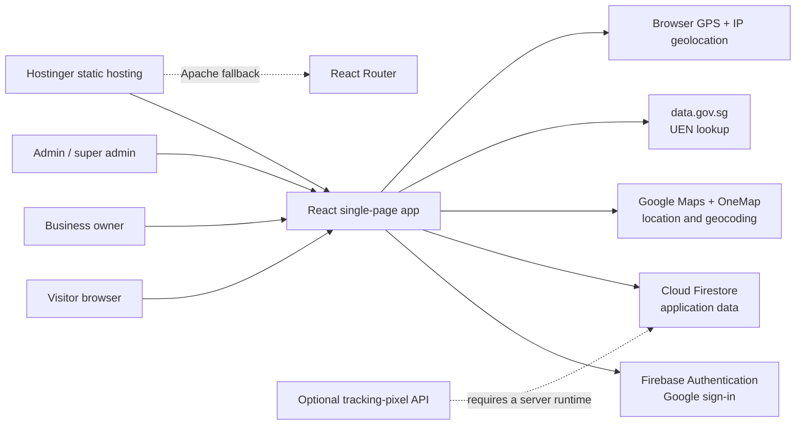
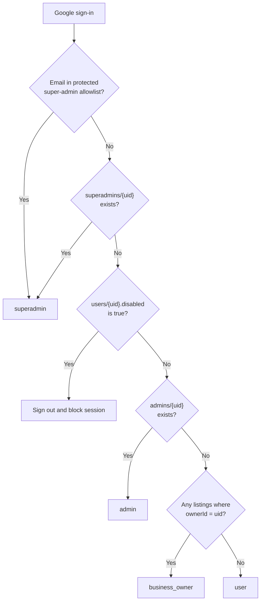
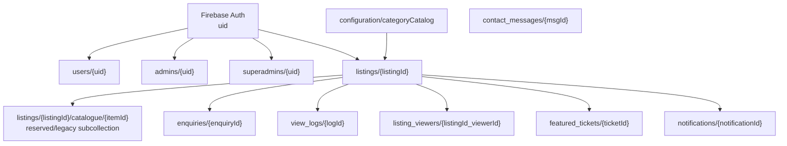
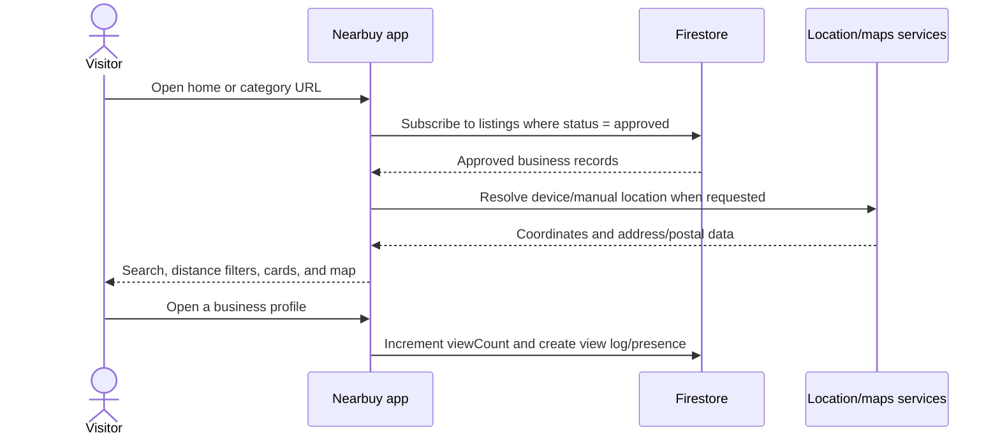
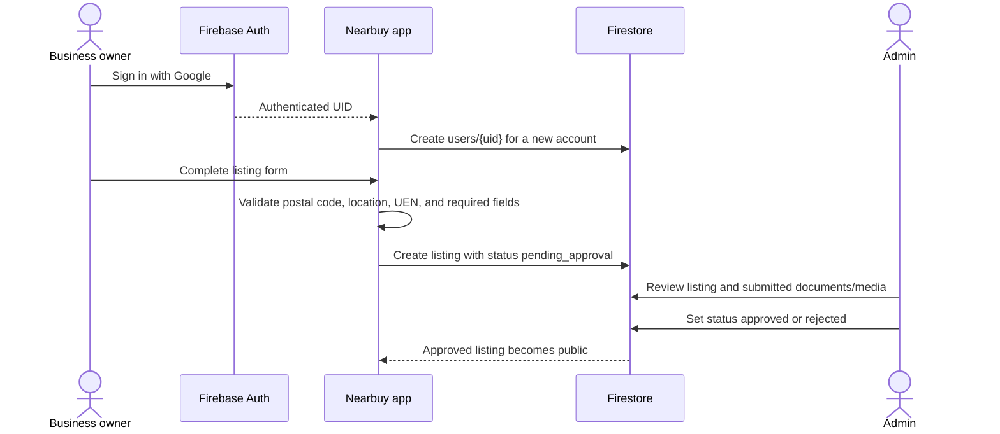
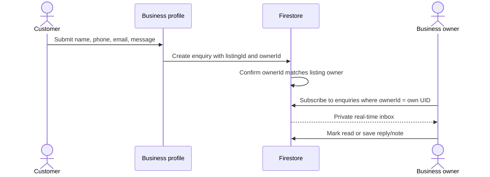
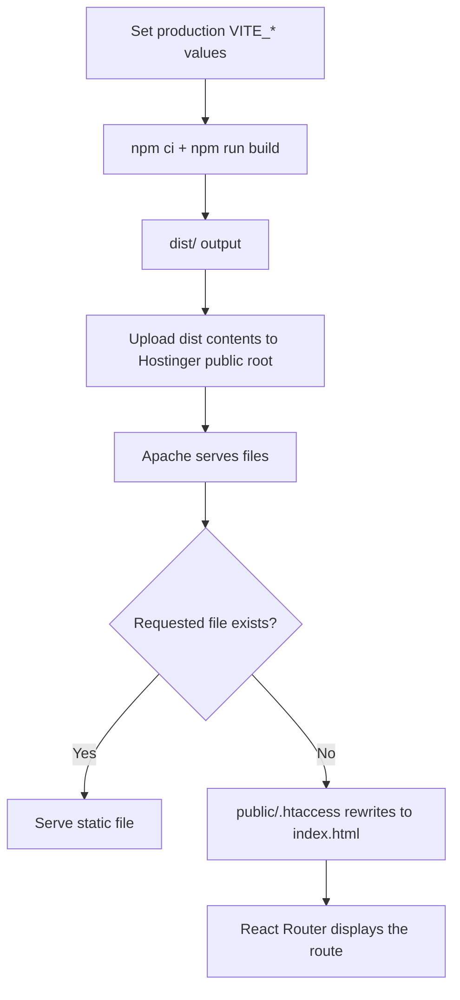

# Nearbuy System Architecture

This document describes the website, database, permissions, integrations, and deployment model as they are implemented in the repository. Nearbuy is a Singapore-focused business directory with public discovery pages, business-owner tools, and an administration panel.

## 1. System overview



The production website is primarily a client-side application. Firebase supplies authentication and database access directly to the browser. Firestore Security Rules are therefore the main server-side authorization layer.

## 2. Technology stack

| Layer | Implementation |
| --- | --- |
| Frontend | React 18, TypeScript, Vite |
| Routing | React Router 6 |
| UI | Tailwind CSS, shadcn/ui, Radix UI, Lucide icons |
| Animation | Framer Motion |
| Forms and validation | React Hook Form, Zod, component-level validation |
| Authentication | Firebase Authentication with Google sign-in and Google One Tap |
| Database | Cloud Firestore |
| Media | Compressed base64/data URLs currently stored in listing documents; Firebase Storage is initialized but is not used by the upload components |
| Maps and location | Google Maps, Google Geocoding, OneMap, browser geolocation, OpenStreetMap Nominatim, IP-location fallbacks |
| Analytics | Listing counters, view logs, live-viewer presence, Recharts dashboards |
| Testing | Vitest and Testing Library |
| Hosting | Hostinger/Apache static hosting with an `.htaccess` SPA fallback |

## 3. Repository structure

```text
sg-find/
|-- api/
|   `-- pixel.js                 # Optional server-side tracking pixel
|-- public/
|   |-- .htaccess               # Hostinger React Router fallback
|   `-- ...                     # Static public assets and postal-code data
|-- src/
|   |-- assets/                 # Images and bundled assets
|   |-- components/             # Shared UI and feature components
|   |   |-- admin/              # Admin-specific components
|   |   |-- business-detail/    # Business profile sections
|   |   `-- ui/                 # shadcn/Radix primitives
|   |-- contexts/               # Authentication, search, and application state
|   |-- hooks/                  # Category, location, analytics, and UI hooks
|   |-- lib/                    # Firebase, geocoding, demo data, utilities
|   |-- pages/                  # Route-level screens
|   |-- test/                   # Vitest test suite
|   |-- App.tsx                 # Route definitions and app providers
|   `-- main.tsx                # Browser entry point
|-- firestore.rules             # Firestore authorization and validation
|-- package.json                # Dependencies and scripts
|-- vite.config.ts              # Local server, proxy, and production build
|-- vercel.json                 # Legacy/optional Vercel deployment configuration
`-- ARCHITECTURE.md             # This document
```

## 4. Website routes

| Route | Audience | Purpose |
| --- | --- | --- |
| `/` | Public | Home, search, filters, nearby businesses, list/map views |
| `/:citySlug` | Public | Businesses for a Singapore area/city slug |
| `/:citySlug/:categorySlug` | Public | Area and category landing page |
| `/:areaSlug/:categorySlug/:businessSlug` | Public; owner preview supported | Business profile, catalogue, contact actions, enquiry form, maps, view tracking |
| `/signup` | Public | Create an account with Google |
| `/login` | Public | Sign in with Google |
| `/add-listing` | Signed-in user | Multi-step business submission and postal/UEN verification |
| `/dashboard` | Business owner | Listings, enquiries, catalogue, hours, analytics, featured requests, settings |
| `/admin` | Admin or super admin | Listing moderation, users, categories, analytics, activity, settings |
| `/about` | Public | About page |
| `/contact` | Public | Platform contact form |
| `/terms` | Public | Terms of service |
| `/privacy` | Public | Privacy policy |
| `/seed` | Development only | Seed demo Firestore data; not included in production builds |
| `/generate-sitemap` | Internal/development | Generate sitemap content |
| `*` | Public | Application-level not-found page |

Route order matters because the business-detail route has three dynamic segments and the area/category pages have one or two.

## 5. Authentication and roles

The Firebase Authentication user ID (`uid`) is the shared identity key across Firestore.



| Role | How it is resolved | Main capabilities |
| --- | --- | --- |
| Guest | No Firebase session | Browse approved listings, submit enquiries/contact messages, contribute view tracking |
| User | Signed in, no elevated role and no owned listing | Submit a new listing |
| Business owner | Owns one or more listing documents | Manage owned listings, catalogue, business hours, analytics, enquiries, featured requests |
| Admin | `admins/{uid}` exists | Moderate all listings, view users, read contact messages, process featured tickets |
| Super admin | Protected email allowlist or `superadmins/{uid}` exists | All admin powers plus role management, category configuration, account control, and privileged deletes |

The development role bypass only runs when Vite is in development mode and `VITE_ENABLE_DEV_BYPASS=true`.

## 6. Firestore database structure

Firestore is document-based and intentionally denormalized. References such as `ownerId` and `listingId` are string IDs rather than database joins.



### `configuration/categoryCatalog`

Global category configuration, readable by everyone and writable only by a super admin.

| Field | Type | Meaning |
| --- | --- | --- |
| `categories` | array | Category objects with `name` and `subcategories` |
| `categories[].name` | string | Display name of the business category |
| `categories[].subcategories` | array | Objects containing `label` and slug-like `value` |
| `categoryNames` | string array | Flat list used by Firestore Rules to validate new and edited listings |
| `updatedAt` | timestamp | Last update time |
| `updatedBy` | string | Super-admin Firebase UID |

### `users/{uid}`

Application profile paired with a Firebase Authentication account.

| Field | Type | Meaning |
| --- | --- | --- |
| `email` | string | Google account email |
| `displayName` / `name` | string | User display name |
| `phone` | string | Optional synchronized contact number |
| `createdAt` | timestamp | Profile creation time |
| `disabled` | boolean | Application-level account block checked during sign-in |

The document ID must equal the signed-in user's Firebase UID. Role is not normally stored here; it is derived from role documents and listing ownership.

### `admins/{uid}` and `superadmins/{uid}`

Role-grant documents managed by super admins.

| Field | Type | Meaning |
| --- | --- | --- |
| `email` | string | Account email for administration display |
| `grantedBy` | string | Granting super admin email or UID |
| `grantedAt` | timestamp | Grant time |

Protected super-admin email addresses are deliberately not repeated in this document. They currently exist in both the authentication context and Firestore Rules and must remain synchronized.

### `listings/{listingId}`

The central business record. Firestore generates `listingId` when an owner submits a business.

| Field group | Fields |
| --- | --- |
| Identity | `name`, `ownerName`, `ownerId`, `ownerEmail`, `uen`, `category`, `subcategoryList`, `subcategoryData` |
| Address | `district`, `city`, `address`, `unitNumber`, `postalCode`, `location` (GeoPoint), `lat`, `lng` |
| Description | `shortDescription`, `shortDescriptor`, `description`, `customSlug`, `priceRange` |
| Contact | `contactEmail`, `email`, `phone`, `whatsapp`, `website`, `primaryContact`, `contactDetails` |
| Contact details | `contactDetails.whatsapp`, `whatsappMessage`, `instagram`, `twitter`, `youtube`, `website`, `secondary` |
| Service setup | `serviceLocations`, `travelArea`, `workingHours`, `operatingHours`, `specialHours`, `complianceChecks` |
| Media | `logoUrl`, `coverImage`, `imageUrls`, `documentsUrl`, `pendingLogoUrl`, `pendingImageUrls` |
| Commerce | `catalogueEnabled`, `catalogueItems`, `offers` |
| Moderation | `status`, `rejectionReason`, `verified`, `featured`, `previousApproved` |
| Analytics | `viewCount` |
| Audit | `createdAt` and other update timestamps where supplied by an editing flow |

Important nested shapes:

```ts
type ListingStatus = "pending_approval" | "approved" | "rejected";

type CatalogueItem = {
  id: string;
  title: string;
  description: string;
  price: string;
  image?: string;
};

type OperatingHours = Record<
  string,
  { open: string; close: string; closed?: boolean }
>;

type Offer = {
  id: string;
  title: string;
  description: string;
  discount: string;
  validUntil: string;
  code?: string;
};
```

New owner submissions always start as `pending_approval`. Only approved listings are publicly readable. An owner may edit their own document but cannot set `verified` or `featured`. Admins can approve, reject, edit, feature, verify, or delete listings.

The active dashboard stores catalogue items in the listing's embedded `catalogueItems` array. Firestore Rules also define `listings/{listingId}/catalogue/{itemId}` for a possible older or future subcollection model.

### `enquiries/{enquiryId}`

Customer-to-business messages.

| Field | Type | Meaning |
| --- | --- | --- |
| `listingId` | string | Target listing ID |
| `listingName` | string | Denormalized business name |
| `ownerId` | string | Target listing owner's UID |
| `name` | string | Customer name |
| `email` | string | Optional customer email |
| `phone` | string | Customer mobile number |
| `message` | string | Optional enquiry text |
| `status` | string | Starts as `unread`; owner inbox also uses `read` and `replied` |
| `reply` | string | Owner's saved reply/note |
| `createdAt` | timestamp | Submission time |
| `repliedAt` | timestamp | Reply/note time |

On create, Firestore verifies that `ownerId` matches the actual owner of `listingId`. After submission, only that business owner can read or update the enquiry. Platform admins and super admins are intentionally excluded from enquiry contents.

### `view_logs/{logId}`

Append-only listing analytics events.

| Field | Type | Meaning |
| --- | --- | --- |
| `listingId` | string | Viewed listing |
| `timestamp` | timestamp | View time |

Owners can read logs for their listings; admins can read all logs. Public clients can create valid listing-view events.

### `listing_viewers/{listingId_viewerId}`

Short-lived presence records for the live-viewer counter.

| Field | Type | Meaning |
| --- | --- | --- |
| `listingId` | string | Listing currently being viewed |
| `viewerId` | string | Random browser-session viewer ID |
| `lastSeen` | timestamp | Refreshed every 30 seconds |

The UI counts a viewer as active when `lastSeen` is less than 60 seconds old. Client deletion is denied, so stale records remain in Firestore but stop affecting the displayed count.

### `contact_messages/{msgId}`

Messages sent to the Nearbuy platform team.

| Field | Type | Meaning |
| --- | --- | --- |
| `name` | string | Sender name |
| `email` | string | Sender email |
| `subject` | string | Message subject |
| `message` | string | Message body |
| `status` | string | Starts as `unread` |
| `createdAt` | timestamp | Submission time |

Anyone can create a validated message. Admins can read messages; only super admins can update or delete them.

### `featured_tickets/{ticketId}`

Business-owner requests for featured placement.

| Field | Type | Meaning |
| --- | --- | --- |
| `listingId` | string | Requested listing |
| `listingName` | string | Denormalized business name |
| `ownerId` | string | Requesting owner's UID |
| `ownerEmail` | string | Requesting account email |
| `reason` | string | Owner's request reason |
| `status` | string | Starts as `pending` |
| `createdAt` | timestamp | Request time |

Owners can create and read their own tickets. Admins can read, update, and delete tickets.

### `notifications/{notificationId}`

Email-ready records created after image moderation.

| Field | Type | Meaning |
| --- | --- | --- |
| `type` | string | `image_approved` or `image_rejected` |
| `recipientEmail` | string | Business recipient |
| `recipientId` | string | Owner UID |
| `listingId` | string | Related listing |
| `imageType` | string | `logo` or `photos` |
| `subject` | string | Rendered email subject |
| `html` | string | Rendered email body |
| `read` | boolean | Processing/read flag |
| `sent` | boolean | Delivery flag |
| `createdAt` | timestamp | Creation time |

This collection is an outbox, not an email sender by itself. A Cloud Function, server process, or manual worker is required to send queued emails and update `sent`.

## 7. Firestore access matrix

| Data | Guest | User | Business owner | Admin | Super admin |
| --- | --- | --- | --- | --- | --- |
| Category catalogue | Read | Read | Read | Read | Read/write |
| Own user profile | - | Read/write | Read/write | Read/update all | Full account control |
| Approved listings | Read | Read | Read | Read/write | Read/write |
| Pending/rejected listing | - | Own only | Own only | Read/write | Read/write |
| Create listing | - | Own UID, verified email | Own UID, verified email | Yes | Yes |
| Delete listing | - | No | No | Yes | Yes |
| Business enquiries | Create | Create | Create; read/update own inbox | No | No |
| View logs | Create | Create | Create/read own | Read all | Read all |
| Live viewers | Read/write presence | Read/write presence | Read/write presence | Read/write presence | Read/write presence |
| Contact messages | Create | Create | Create | Read | Read/update/delete |
| Featured tickets | - | Create/read own | Create/read own | Read/update/delete | Read/update/delete |
| Notification outbox | - | - | - | Create/read | Create/read/update/delete |
| Admin role grants | - | - | - | Own role document readable | Manage grants |

The final catch-all rule denies every collection and operation not explicitly listed in `firestore.rules`.

## 8. Main working flows

### Public discovery



### Registration and listing approval



### Enquiry workflow



### Business-owner dashboard

The dashboard loads listings where `ownerId` equals the signed-in UID. It supports:

- listing edits and resubmission after rejection;
- pending media review through `pendingLogoUrl` and `pendingImageUrls`;
- embedded product/service catalogue management;
- weekly and special operating hours;
- private real-time enquiry inbox;
- view counters and analytics;
- featured-listing requests.

### Administration

Admins moderate listings and review platform data. Super admins additionally manage users, admin grants, super-admin grants, and the global category catalogue. The `/admin` page checks the resolved role before loading protected data.

## 9. External services

| Service | Purpose | Notes |
| --- | --- | --- |
| Firebase Authentication | Google sign-in and persistent sessions | Authorized production domains must be configured in Firebase Console |
| Cloud Firestore | Main database and real-time listeners | Deploy `firestore.rules` separately; deploying static files does not deploy rules |
| Firebase Storage | Initialized in code | Current upload components store compressed data URLs instead |
| Google Maps JavaScript API | Interactive maps | Browser key should be restricted by HTTP referrer and API |
| Google Geocoding API | Postal/address coordinate fallback | Called from the browser |
| Google Identity Services | Google One Tap | Uses `VITE_GOOGLE_CLIENT_ID` |
| OneMap | Singapore postal-code/address lookup | Vite and Vercel proxy `/api-onemap`; production code also has a direct fallback |
| data.gov.sg | UEN/ACRA lookup | Used during listing submission |
| Browser Geolocation | Device position | Requires HTTPS and user permission |
| OpenStreetMap Nominatim | Reverse-geocoding fallback in the header | Public endpoint usage policies apply |
| freeipapi / GeoJS | Network-location fallback | Used by the home-page location flow |
| WhatsApp and social URLs | Customer contact actions | Opens external apps/sites |

## 10. Environment variables

Only variable names belong in shared project files. Real values must stay in the local `.env` file or the hosting environment.

```dotenv
VITE_FIREBASE_API_KEY=
VITE_FIREBASE_AUTH_DOMAIN=
VITE_FIREBASE_PROJECT_ID=
VITE_FIREBASE_STORAGE_BUCKET=
VITE_FIREBASE_MESSAGING_SENDER_ID=
VITE_FIREBASE_APP_ID=
VITE_GOOGLE_MAPS_API_KEY=
VITE_GOOGLE_CLIENT_ID=

# Development switch
VITE_ENABLE_DEV_BYPASS=false
```

Vite embeds `VITE_*` values into the browser bundle at build time. They are configuration, not server secrets. Firebase and Maps security must come from Firestore Rules, authorized domains, API restrictions, and quotas. Never commit private service-account credentials.

## 11. Hostinger production model



Production checklist:

1. Install dependencies with `npm ci`.
2. Supply production environment variables before the build.
3. Run `npm run build`.
4. Upload the contents of `dist/`, including the hidden `.htaccess` file, to the Hostinger document root.
5. Confirm Apache `mod_rewrite` and `.htaccess` overrides are enabled.
6. Add the production domain to Firebase Authentication's authorized domains.
7. Restrict the Google Maps key to the production domain.
8. Deploy `firestore.rules` to the correct Firebase project.
9. Test direct reloads of `/admin`, `/dashboard`, city/category pages, and business-detail pages.

`vercel.json` has no effect on Hostinger. Its rewrites, headers, OneMap proxy, and `api/pixel.js` runtime do not automatically transfer to Apache hosting.

The SPA route fallback is covered by `public/.htaccess`. The tracking pixel at `/api/pixel` still needs a Hostinger-supported server endpoint or another serverless host. The application itself tracks profile views directly in Firestore, so this limitation mainly affects externally embedded tracking pixels.

## 12. Development

```sh
npm ci
npm run dev       # http://localhost:5173
npm test
npm run build
```

## 13. Current implementation notes

These are useful constraints for maintainers and are not additional database collections:

- Business images and catalogue images are currently stored as compressed base64 strings inside Firestore documents. This can approach Firestore's document-size limit. Moving media to Firebase Storage or an image CDN and retaining only URLs in Firestore is the scalable model.
- The business dashboard includes a delete action, but current Firestore Rules permit listing deletion only for admins. Owner deletion will be rejected in production unless the desired policy and rules are changed together.
- Firestore Rules deliberately prevent admins and super admins from reading business enquiries. Administration UI code should not be treated as an enquiry inbox.
- `notifications` queues rendered emails but does not send them without an external worker.
- The notification email helper currently builds a `/business-dashboard` link, while the application route is `/dashboard`; align these before enabling automatic email delivery.
- Presence records cannot be deleted by clients. A scheduled cleanup job would control long-term `listing_viewers` collection growth.
- Firebase Storage is initialized, but no `storage.rules` file or active Storage upload flow is present in this repository.
- `/seed` is development-only. `/generate-sitemap` is still an application route but checks admin access before generating data.

## 14. Source-of-truth files

When implementation and documentation differ, use these files as the authoritative source and update this document in the same pull request:

- `src/App.tsx` for routes;
- `src/contexts/AuthContext.tsx` for runtime role resolution;
- `firestore.rules` for actual database permissions;
- `src/components/ListingCard.tsx` and `src/pages/AddListing.tsx` for the listing shape;
- `src/hooks/useCategoryCatalog.ts` for categories;
- `src/components/BusinessEnquiryForm.tsx` and `src/components/EnquiryInbox.tsx` for enquiries;
- `src/hooks/useViewTracking.ts` for analytics and presence;
- `vite.config.ts`, `public/.htaccess`, and `vercel.json` for deployment behavior.
